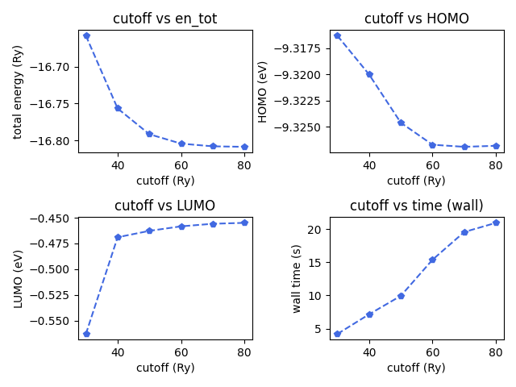

Simple exercise aimed at learning the basics of Quantum Espresso.

The following command was run munually multiple times, with different cutoff values stored in ``example``

``mpirun -np 4 ~/builds/q-e/bin/pw.x < example``

Total energy, HOMO, LUMO and Wall Time are then stored in ``data.txt`` and a simply python script ``plot.py`` is used to plot these values versus the chosen cutoff:

